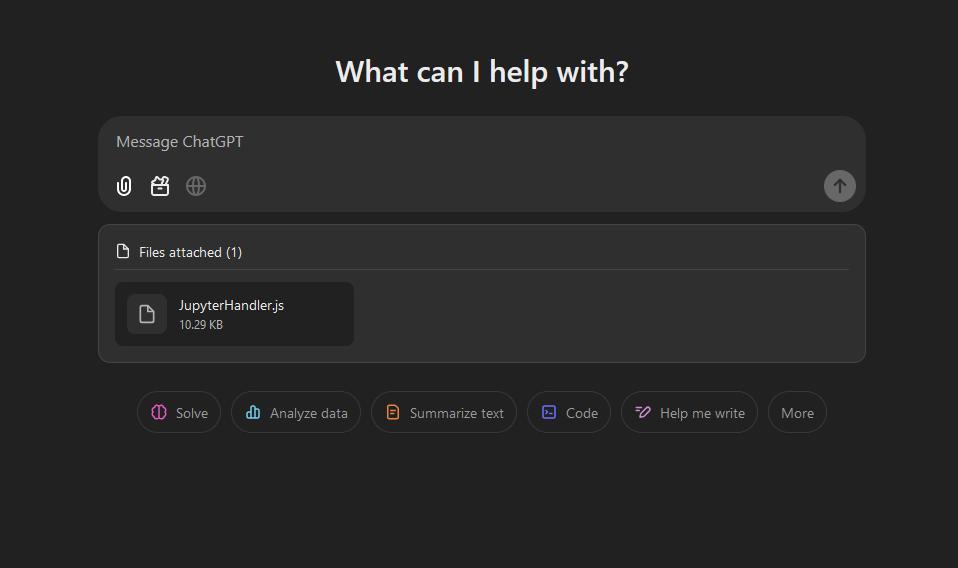
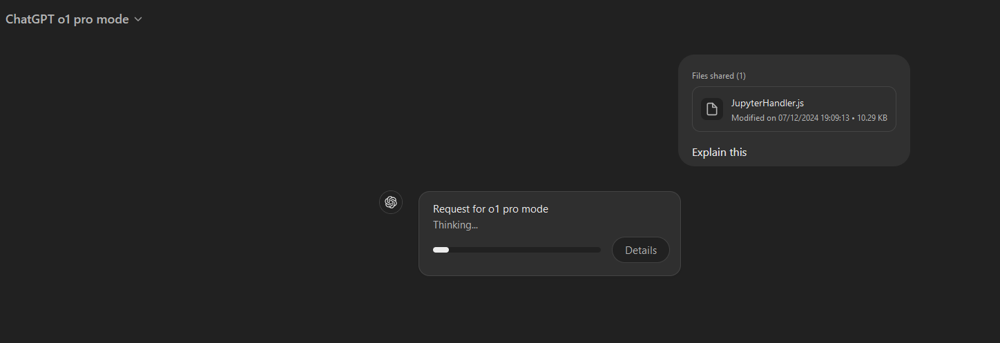
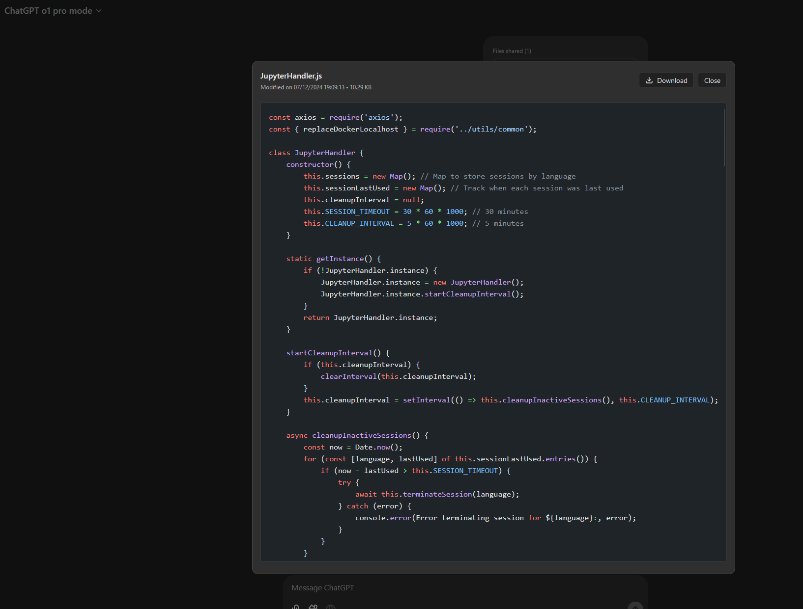

# Real ChatGPT File Uploader

A powerful Tampermonkey userscript that adds true file upload capabilities to ChatGPT, enabling seamless file sharing and management within your conversations.

<div align="center">
  
</div>

## 🌟 Why This Tool?

While ChatGPT's interface has evolved, it still lacks native file upload support for many models (e.g., o1-mini, o1, o1-pro). 
For GPT-4o users who have native file upload, this plugin provides a superior alternative by sending the complete file content directly in the conversation, bypassing ChatGPT's RAG-based file processing. This userscript provides:

- True file upload functionality (not just copy/paste)
- Direct file content transmission (no RAG processing for GPT-4o)
- Proper file parsing that ChatGPT understands
- Clean UI integration with the ChatGPT interface
- Syntax highlighting for code files
- Dark/Light theme support

<div align="center">
  
</div>

## ✨ Key Features

- 📤 **Direct File Upload**: Upload files directly through ChatGPT's interface
- 👀 **Smart Preview**: Preview files before sending, with syntax highlighting for code
- 🎨 **Syntax Highlighting**: Automatic language detection and highlighting for common file types
- 📝 **Message Integration**: Files appear neatly above your messages
- 🔍 **Content Viewer**: Modal viewer with download capability
- 🗑️ **File Management**: Easy file removal and management
- 🌓 **Theme Support**: Seamless integration with ChatGPT's light/dark themes
- 🔒 **Local Processing**: All file handling happens in your browser

<div align="center">
  
</div>

## 📥 Installation

1. Install the [Tampermonkey](https://www.tampermonkey.net/) extension for your browser
2. Click this [installation link](https://raw.githubusercontent.com/clad3815/chatgpt-file-uploader/main/src/chatgpt-upload-files-plugin.user.js)
3. Confirm the installation in Tampermonkey

## 🚀 How to Use

1. Open ChatGPT
2. Click the "+" menu next to the text input
3. Select "Upload Files (Custom)"
4. Choose one or more files
5. Preview and manage your files
6. Send your message as usual

## 🛠️ Technical Details

### Model Compatibility
- **O1 Models**: Adds file upload capability for o1-mini, o1, and o1-pro
- **GPT-4o**: Provides direct file content transmission, bypassing the default RAG-based file processing

### Supported File Types
- Code files (`.js`, `.py`, `.html`, `.css`, `.json`, etc.)
- Text files (`.txt`, `.md`)
- And more...

### File Format
Files are automatically formatted in XML for optimal ChatGPT processing:

```xml
<user_attachments>
  <attachment name="example.js" last_edit="2024-03-20 15:30:00" size="1.2 KB">
    console.log("Hello, World!");
  </attachment>
</user_attachments>
```

## 💡 Tips & Tricks

- Upload multiple files at once for batch processing
- Use the preview feature to verify file contents
- Files can be downloaded from the preview modal
- Remove files easily before sending if needed

## 🤝 Contributing

Contributions are welcome! Feel free to:
- Report bugs
- Suggest features
- Submit pull requests

## 📜 License

MIT License - feel free to use and modify as needed.

## 🙏 Acknowledgments

- [ChatGPT](https://chat.openai.com) for the platform
- [Tampermonkey](https://www.tampermonkey.net/) for making userscripts possible
- [Prism.js](https://prismjs.com/) for syntax highlighting

---

<div align="center">
Made with ❤️ for the ChatGPT community
</div>